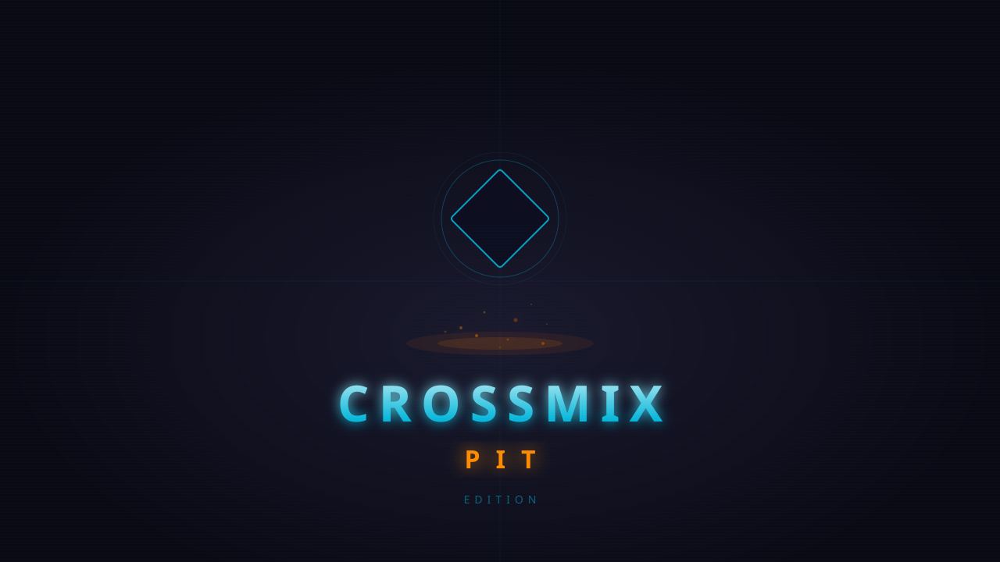

    

_Get the best from your TrimUI Smart Pro_  

  

&nbsp; 

&nbsp;

&nbsp;

&nbsp; 

# Introduction

CrossMix-OS, the OS which elevates your TrimUI Smart Pro to new heights. 

CrossMix-OS uses TrimUI Stock user interface with refined configurations, new features, new emulators and new apps. There are so many differences that CrossMix can be considered an dédicated OS in its own right.

Designed with the community in mind, CrossMix-OS caters to developers and creators alike. It supports a wide range of customizations, including themes, icon packs, background packs, templates for "Best" collections, and automatic overlay configurations.

As a completely free and open-source platform, CrossMix-OS invites you to explore, contribute, and customize to your heart's content.

&nbsp; &nbsp; 

&nbsp; 

# Getting Started

First take a look to CrossMix Wiki, below are the different sections:

&nbsp; 

## 🏠[Home](https://github.com/pietrondo/CrossMix-OS/wiki/Home)

## 🛠️ [Installation](https://github.com/pietrondo/CrossMix-OS/wiki/Installation)

## 🎮 [Emulators](https://github.com/pietrondo/CrossMix-OS/wiki/Emulators)

##  [PortMaster](https://github.com/pietrondo/CrossMix-OS/wiki/PortMaster)

## :iphone: [Apps](https://github.com/pietrondo/CrossMix-OS/wiki/apps)

## ⌨️ [Shortcuts](https://github.com/pietrondo/CrossMix-OS/wiki/shortcuts)

## ❔ [FAQ](https://github.com/pietrondo/CrossMix-OS/wiki/FAQ)

## 🔄 [Updating CrossMix-OS](https://github.com/pietrondo/CrossMix-OS/wiki/Updating)

Three ways to get the latest version:

1. **Updates App** (SD card, no WiFi needed): Download `CrossMix-OS_v*.zip` from [Releases](https://github.com/pietrondo/CrossMix-OS/releases/latest) on your PC, copy to SD root, then open **Apps > Updates** on your device. The update is verified with SHA256 before installation, and automatically rolls back if something goes wrong.
2. **OTA Update** (WiFi required): Connect to WiFi, then open **Apps > OTA update**.
3. **Auto-detection at boot**: If a `CrossMix-OS_v*.zip` is on the SD root, the system prompts to install at boot.

## 🔧 [Advanced Guides](https://github.com/pietrondo/CrossMix-OS/wiki/Advanced-Guides)

## 🛈 [About](https://github.com/pietrondo/CrossMix-OS/wiki/About)

## 🎁 [Contributing](https://github.com/pietrondo/CrossMix-OS/wiki/Contributing)

&nbsp; 

## 📋 Changelog

### v1.7.1 - CrossMix-Pit Edition
- **Toolbox App**: dashboard unificata (health check, export debug, backup salvataggi, cheat, dedup core)
- **Game Switcher**: quick-switch tra giochi recenti (via Apps)
- **Hooks system** (18 hook boot/pre/post): CPU scaling, audio quality, RetroAchievements, NTP sync, battery history, game time tracker, log rotation, auto-backup, low battery alert
- **Scraper multithread**: parallel scraping via xargs -P (1-8 workers), resume dopo interrupt, retry migliorato
- **Logging centralizzato**: `log_message()`, `gather_logs.sh`, `log_manager.sh` (view/clear/export)
- **RetroAchievements**: integrazione automatica via hook
- **Battery + Game stats**: storico SQLite con trend, `battery_stats.sh` e `game_stats.sh`
- **Cheats**: download automatico database cheat da RetroArch buildbot
- **Boot logo Cross-Pit**: nuovo logo con tema "pit" (fuoco + ciano)
- **CJK font**: supporto titoli asiatici (cinese/giapponese/coreano)
- **Save backup**: backup/restore automatico salvataggi e stati
- **CrossMix Doctor**: health check completo (18 validazioni)
- **Core tools**: `core_strip.sh` (-30/50% spazio), `core_dedup.sh` (analisi ridondanti)
- **Flycast v2.6 standalone**: integrato per DC/NAOMI/ATOMISWAVE (OpenGL ES, per-pixel rendering)
- **Primo avvio automatico**: `setup.sh --full` eseguito automaticamente a ogni update
- **16 tool script**: gather_logs, log_manager, battery_stats, game_stats, cheats_update, display_probe, core_strip, core_dedup, cjk_font, setup, doctor, save_backup, scrap_worker/master/state

### v1.7.0 - CrossMix-Pit Edition
- Atomic update + MAME fix + wget resume + .info files

### v1.6.0 - CrossMix-Pit Edition
- **Firmware 1.1.1**: piena compatibilita' con l'ultimo TrimUI stock firmware
- **8 nuovi core**: bsnes, doukutsu_rs, emuscv, mednafen_psx_hw, smsplus, onsyuri, libgametank, puzzlescript
- **SMS (Sega Master System)**: nuovo emulatore con core smsplus
- **19 core grandi**: scaricati automaticamente da upstream nella release zip (MAME, Flycast, FB Neo, etc.)
- **`make_release.ps1`**: script PowerShell per costruire lo zip release con tutti i core
- **`download_cores.sh`**: script on-device per aggiornare i core
- **Test automatizzati**: `tests/run_tests.sh` per verifica funzioni critiche
- Rimossi emulatori non richiesti (Apple II, J2ME, Vircon32)

### v1.5.0
- Rollback automatico, SHA256 verification, progress bar durante estrazione
- CI/CD: checksum SHA256 generato per ogni release

### v1.4.0
- Apps/Updates, sicurezza TLS, SHA1 verification, set -u, env.sh centralizzato
- 132 core RetroArch aggiornati da upstream aarch64

&nbsp; &nbsp; 

&nbsp;

# About the project

CrossMix-OS was created by **Cizia**, a passionate retrogamer who felt the TrimUI Smart Pro deserved a more mature OS, better configured, and with more options. After countless hours of work, the first version was shared with the community — and it quickly became the reference OS for the TrimUI Smart Pro.

Key features introduced by CrossMix-OS:

- **Background and icon selectors**: seamlessly complement the native theme selector.
- **Overlay selector**: one-click configuration of default display ratio and overlay for all platforms, plus new dedicated overlays.
- **SwanStation 16/9 mode launcher**.
- **Extensive work on emulator launchers and configuration**.
- **Default customization**: custom theme, icons and backgrounds, Polish language support, and many new tools.
- **Firmware Update Wizard**: an automatic guide helping users update their firmware.
- **Best packs standardization**: generic launcher, game shortcuts support, and folder images.

Special thanks to **Kloptops** for [PortMaster and tools](https://github.com/kloptops/TRIMUI_EX) deeply integrated into CrossMix-OS.

Thanks to **Schmurtzm** for numerous scripts, revised and integrated into CrossMix-OS, which have greatly enhanced the available features:
- [PSX Analog Detector](https://github.com/schmurtzm/TrimUI-Smart-Pro/blob/main/SystemTools/Apps/SystemTools/Menu/EMULATORS/PSX%20Analog%20Detector.sh): Detects PSX games compatible with analog sticks and automatically sets the correct controller configuration.
- [BootLogo](https://github.com/schmurtzm/TrimUI-Smart-Pro/tree/main/Bootlogo): An app for easy boot logo flashing on TrimUI Smart Pro.
- [EmuCleaner](https://github.com/schmurtzm/TrimUI-Smart-Pro/tree/main/EmuCleaner): An app to display only emulators with ROMs installed.
- [System Tools](https://github.com/schmurtzm/TrimUI-Smart-Pro/tree/main/SystemTools): An app to centralize different apps/scripts in one place.
- [Resume at Boot](https://github.com/schmurtzm/TrimUI-Smart-Pro/tree/main/ResumeAtBoot): A set of scripts to add a resume game on startup feature.
- [Subfolder config override finder](https://github.com/libretro/RetroArch/issues/12021#issuecomment-2107300989) is also used in CrossMix-OS.
- [Scraper](https://github.com/schmurtzm/TrimUI-Smart-Pro/tree/main/Scraper): an app to automatically download boxarts.

CrossMix-OS aims to be the reference OS based on the stock TrimUI firmware, continuously improving with community support.

&nbsp; &nbsp; 

